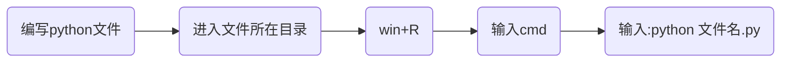

# Python编程从入门到实践


## 第1章 起 步

### 1.1 环境搭建

在不同的操作系统中，Python存在细微的差别。

#### 1.1.1 Python 2和 Python 3

当前，有两个不同的Python版本：Python 2和较新的Python 3。

如果你的系统安装的是Python 3，那么有些使用Python 2编写的代码可能无法正确地运行。

>
>
>Tip：直接选择学Python3


#### 1.1.2 Python解释器

当我们从[Python官方网站](https://www.python.org/)下载并安装好Python 3.x后，我们就直接获得了一个官方版本的解释器：CPython。这个解释器是用C语言开发的，所以叫CPython。在命令行下运行`python`就是启动CPython解释器。

Python的解释器很多，但使用最广泛的还是CPython。


#### 1.1.3 Hello World 程序

```python
print("Hello World")
```


### 1.2 在不同操作系统中搭建 Python 编程环境

[Python各版本下载](https://www.python.org/downloads/)


### 1.3 解决安装问题

[自行谷歌解决](http://www.google.cn/)


### 1.4 从终端运行 Python 程序

#### 1.4.1 在 Windows 系统中从终端运行 Python 程序



### 1.5 小结

本章需要掌握知识点：

- 掌握Python环境搭建
- 了解Python解释器
- 编写并运行Hello_world.py
- 会在[Python官网](https://www.python.org/)上检索资料


## 第2章 变量和简单数据类型

### 2.1 运行 hello_world.py 时发生的情况


### 2.2 变量

**变量**：可以变化的量

变量的简单使用：

```python
message = "Hello Python World!"
print(message)
```

 

上面的运行结果：


上述代码中**message**就是定义的一个变量，**message**和文本“**Hello Python World**”相关联。

>
>
>Tip: 在程序运行过程中，变量的值是可以发生改变的，python会记录变量最新的值。


#### 2.2.1 变量的命名和使用

- 变量名只能包含**字母**、**数字**和**下划线**。变量名可以字母或下划线打头，但**不能以数字开头**
- 不要将**Python关键字**和**函数名**用作变量名，即不要使用Python保留用于特殊用途的单词
- 变量名应做到见名知意(非Python强制要求，属于编码习惯，不会出现python语法错误)
- 慎用小写字母l和大写字母O，因为它们可能被人错看成数字1和0(非Python强制要求，属于编码习惯，不会出现python语法错误)


​    **Python关键字和内置函数**：  


#### 2.2.2 使用变量时避免命名错误


### 2.3  字符串

计算机顾名思义就是可以做数学计算的机器，因此，计算机程序理所当然地可以处理各种数值。但是，计算机能处理的远不止数值，还可以处理文本、图形、音频、视频、网页等各种各样的数据，不同的数据，需要定义不同的数据类型(分类管理，避免乱套)。在Python中，能够直接处理的数据类型有以下几种：

- 整数
- 浮点数
- 字符串
- 布尔值
- 空值
- 列表
- 字典
- 自定义数据类型


**字符串**是以单引号`'`或双引号`"`括起来的任意文本，比如`'abc'`，`"xyz"`等等。

```python
"This is a string."
'This is also a string.'
```

>
>
>Tip:  `''`或`""`本身只是一种表示方式，不是字符串的一部分，因此，字符串`'abc'`只有`a`，`b`，`c`这3个字符。如果`'`本身也是一个字符，那就可以用`""`括起来，比如`"I'm OK"`包含的字符是`I`，`'`，`m`，空格，`O`，`K`这6个字符。


#### 2.3.1 使用方法修改字符串的大小写

```方法名：title()```     

```功能:```将每个单词的首字母大写

```示例：```

```python
message = "houyanzi hunyiha"
message.title()
```

```输出:```

```python
Houyanzi Hunyiha
```


```方法名：lower()```   

```功能：```将所有的单词小写

```使用场景:```验证码忽略大小写的时候，校验

```示例：```

```python
message = "HouYanZi HunYiHa"
message.lower()
```

```输出:```

```python
houyanzi hunyiha
```


#### 2.3.2 合并（拼接）字符串

Python使用加号（ + ）来合并字符串。


#### 2.3.3 使用制表符或换行符来添加空白

在编程中， 空白泛指任何非打印字符(打印出来看不见)，如空格、制表符和换行符。空白可以用来格式化输出。

​	```换行符：``` \\n

​	```制表符:``` \\t


#### 2.3.4 删除空白

```方法名：rstrip()```

```功能：```删除字符串末尾的空白字符

```助记:```right + strip剔除

```示例：```

```python
message = "HouYanZi HunYiHa  "
message.rstrip()
```

```输出:```

​			```houyanzi hunyiha```


```方法名：lstrip()```

```功能：```删除字符串前面的空白字符

```助记:```left + strip

```示例：```

```python
message = "   HouYanZi HunYiHa"
message.rstrip()
```

```输出:```

​			```houyanzi hunyiha```


```方法名：strip()```

```功能：```删除字符串两端的空白字符

```助记:```  strip剔除

```示例：```

```python
message = "   HouYanZi HunYiHa   "
message.rstrip()
```

```输出:```

​			```houyanzi hunyiha```


>
>
>strip()、lstrip()、rstrip()不会对变量本身作出改变，如果要改变需要使用该变量去接收方法的返回值！


#### 2.3.5 使用字符串时避免语法错误


#### 2.3.6 Python 2 中的 print 语句


### 2.4 数字

在Python中，可对整数执行加（ + ）减（ - ）乘（ * ）除（ / ）运算。
