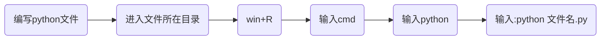

# Python编程从入门到实践


## 第1章 起 步

### 1.1 环境搭建

在不同的操作系统中，Python存在细微的差别。

#### 1.1.1 Python 2和 Python 3

当前，有两个不同的Python版本：Python 2和较新的Python 3。

如果你的系统安装的是Python 3，那么有些使用Python 2编写的代码可能无法正确地运行。

>
>
>Tip：直接选择学Python3


#### 1.1.2 Python解释器

当我们从[Python官方网站](https://www.python.org/)下载并安装好Python 3.x后，我们就直接获得了一个官方版本的解释器：CPython。这个解释器是用C语言开发的，所以叫CPython。在命令行下运行`python`就是启动CPython解释器。

Python的解释器很多，但使用最广泛的还是CPython。


#### 1.1.3 Hello World 程序

```python
print("Hello World")
```


### 1.2 在不同操作系统中搭建 Python 编程环境

[Python各版本下载](https://www.python.org/downloads/)


### 1.3 解决安装问题

[自行谷歌解决](http://www.google.cn/)


### 1.4 从终端运行 Python 程序

#### 1.4.1 在 Windows 系统中从终端运行 Python 程序



### 1.5 小结

本章需要掌握知识点：

- 掌握Python环境搭建
- 了解Python解释器
- 编写并运行Hello_world.py
- 会在[Python官网](https://www.python.org/)上检索资料

