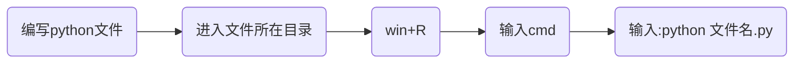

# Python编程从入门到实践


## 第1章 起 步

### 1.1 环境搭建

在不同的操作系统中，Python存在细微的差别。

#### 1.1.1 Python 2和 Python 3

当前，有两个不同的Python版本：Python 2和较新的Python 3。

如果你的系统安装的是Python 3，那么有些使用Python 2编写的代码可能无法正确地运行。

>
>
>Tip：直接选择学Python3


#### 1.1.2 Python解释器

当我们从[Python官方网站](https://www.python.org/)下载并安装好Python 3.x后，我们就直接获得了一个官方版本的解释器：CPython。这个解释器是用C语言开发的，所以叫CPython。在命令行下运行`python`就是启动CPython解释器。

Python的解释器很多，但使用最广泛的还是CPython。


#### 1.1.3 Hello World 程序

```python
print("Hello World")
```


### 1.2 在不同操作系统中搭建 Python 编程环境

[Python各版本下载](https://www.python.org/downloads/)


### 1.3 解决安装问题

[自行谷歌解决](http://www.google.cn/)


### 1.4 从终端运行 Python 程序

#### 1.4.1 在 Windows 系统中从终端运行 Python 程序



### 1.5 小结

本章需要掌握知识点：

- 掌握Python环境搭建
- 了解Python解释器
- 编写并运行Hello_world.py
- 会在[Python官网](https://www.python.org/)上检索资料


## 第2章 变量和简单数据类型

### 2.1 运行 hello_world.py 时发生的情况


### 2.2 变量

**变量**：可以变化的量

变量的简单使用：

```python
message = "Hello Python World!"
print(message)
```

 

上面的运行结果：


上述代码中**message**就是定义的一个变量，**message**和文本“**Hello Python World**”相关联。

>
>
>Tip: 在程序运行过程中，变量的值是可以发生改变的，python会记录变量最新的值。


#### 2.2.1 变量的命名和使用

- 变量名只能包含**字母**、**数字**和**下划线**。变量名可以字母或下划线打头，但**不能以数字开头**
- 不要将**Python关键字**和**函数名**用作变量名，即不要使用Python保留用于特殊用途的单词
- 变量名应做到见名知意(非Python强制要求，属于编码习惯，不会出现python语法错误)
- 慎用小写字母l和大写字母O，因为它们可能被人错看成数字1和0(非Python强制要求，属于编码习惯，不会出现python语法错误)


​    **Python关键字和内置函数**：  

​	

​		

#### 2.2.2 使用变量时避免命名错误


### 2.3  字符串

计算机顾名思义就是可以做数学计算的机器，因此，计算机程序理所当然地可以处理各种数值。但是，计算机能处理的远不止数值，还可以处理文本、图形、音频、视频、网页等各种各样的数据，不同的数据，需要定义不同的数据类型(分类管理，避免乱套)。在Python中，能够直接处理的数据类型有以下几种：

- 整数
- 浮点数
- 字符串
- 布尔值
- 空值
- 列表
- 字典
- 自定义数据类型


**字符串**是以单引号`'`或双引号`"`括起来的任意文本，比如`'abc'`，`"xyz"`等等。

```python
"This is a string."
'This is also a string.'
```

>
>
>Tip:  `''`或`""`本身只是一种表示方式，不是字符串的一部分，因此，字符串`'abc'`只有`a`，`b`，`c`这3个字符。如果`'`本身也是一个字符，那就可以用`""`括起来，比如`"I'm OK"`包含的字符是`I`，`'`，`m`，空格，`O`，`K`这6个字符。


#### 2.3.1 使用方法修改字符串的大小写

```方法名：title()```     

```功能:```将每个单词的首字母大写

```示例：```

```python
message = "houyanzi hunyiha"
message.title()
```

```输出:```

```python
Houyanzi Hunyiha
```


```方法名：lower()```   

```功能：```将所有的单词小写

```使用场景:```验证码忽略大小写的时候，校验

```示例：```

```python
message = "HouYanZi HunYiHa"
message.lower()
```

```输出:```

```python
houyanzi hunyiha
```


#### 2.3.2 合并（拼接）字符串

Python使用加号（ + ）来合并字符串。


#### 2.3.3 使用制表符或换行符来添加空白

在编程中， 空白泛指任何非打印字符(打印出来看不见)，如空格、制表符和换行符。空白可以用来格式化输出。

​	```换行符：``` \\n

​	```制表符:``` \\t


#### 2.3.4 删除空白

```方法名：rstrip()```

```功能：```删除字符串末尾的空白字符

```助记:```right + strip剔除

```示例：```

```python
message = "HouYanZi HunYiHa  "
message.rstrip()
```

```输出:```

​			```houyanzi hunyiha```


```方法名：lstrip()```

```功能：```删除字符串前面的空白字符

```助记:```left + strip

```示例：```

```python
message = "   HouYanZi HunYiHa"
message.rstrip()
```

```输出:```

​			```houyanzi hunyiha```


```方法名：strip()```

```功能：```删除字符串两端的空白字符

```助记:```  strip剔除

```示例：```

```python
message = "   HouYanZi HunYiHa   "
message.rstrip()
```

```输出:```

​			```houyanzi hunyiha```


>
>
>strip()、lstrip()、rstrip()不会对变量本身作出改变，如果要改变需要使用该变量去接收方法的返回值！


#### 2.3.5 使用字符串时避免语法错误


#### 2.3.6 Python 2 中的 print 语句


### 2.4 数字

#### 2.4.1 整数

在Python中，可对整数执行加（ + ）减（ - ）乘（ * ）除（ / ）乘方（**）运算。

```cmd
>>> 1 + 1
2
>>> 2 - 1
1
>>> 2 * 2
4
>>> 3 / 2
1.5
>>> 2 ** 3
8
```


#### 2.4.2 浮点数

带小数点的数字都称为**浮点数**。浮点数的计算结果不一定准确(计算机中整数和浮点数储存方式不一样)。

```cmd
>>> 0.1 + 0.1
0.2
>>> 0.2 + 0.2
0.4
>>> 0.2 * 2
0.4
>>> 0.1 + 0.2
0.30000000000000004
```

>
>
>Tip：上面0.1 + 0.2结果出现了0.30000000000000004。


#### 2.4.3 使用函数 str()避免类型错误

birthday.py

***

```python
age = 23 
message = "Happy " + age + "rd Birthday!"
print(message)
```

上述代码会出现异常，因为age是数字类型，不能直接和字符串进行**+**运算。

可以调用函数str()将数字转换为字符串。


#### 2.4.4 Python 2 中的整数

```cmd
>>> python2.7
>>> 3 / 2
1
```

Python2中整数相除只包含整数部分，小数部分被删除，是删除不是四舍五入。


### 2.5 注释

注释是写给人看的。


#### 2.5.1 如何编写注释

在Python中，单行注释用**#**标识，多行注释使用```'''```标识。

```python
# 我是一个注释

'''
	我是多行注释
'''
```


#### 2.5.2 该编写什么样的注释

给人看的注释


#### 2.6 Python 之禅

python终端中输入```import this```查看python之禅

```python
>>> import this
The Zen of Python, by Tim Peters

Beautiful is better than ugly.
Explicit is better than implicit.
Simple is better than complex.
Complex is better than complicated.
Flat is better than nested.
Sparse is better than dense.
Readability counts.
Special cases aren't special enough to break the rules.
Although practicality beats purity.
Errors should never pass silently.
Unless explicitly silenced.
In the face of ambiguity, refuse the temptation to guess.
There should be one-- and preferably only one --obvious way to do it.
Although that way may not be obvious at first unless you're Dutch.
Now is better than never.
Although never is often better than *right* now.
If the implementation is hard to explain, it's a bad idea.
If the implementation is easy to explain, it may be a good idea.
Namespaces are one honking great idea -- let's do more of those!
>>>
```


### 2.7 小结

- 变量的使用
- 变量名命名规范
- 字符串相关的几个方法
- 整数和浮点数的使用


## 第3章 列表简介

### 3.1 列表是什么

列表由一系列按特定顺序排列的元素组成，是**有序集合**。

Python中使用`[]`定义列表，列表中的元素使用```,```隔开。

```python
# 列表的定义
name = ["侯燕子", "臭宝", "宝宝"]

# 列表的打印
print(name)
```

打印结果如下：

```cmd
['侯燕子', '臭宝', '宝宝']
```


#### 3.1.1 访问列表元素

列表是有序集合，可以通过索引访问列表中的元素，索引从0开始。

```语法：```列表名称[索引]

 ```示例:```		

```python
# 定义列表
name = ["侯燕子", "臭宝", "宝宝"]
# 打印列表中索引为1的元素
print(name[1])
```

 打印结果如下：

```cmd
臭宝
```

 >
 >
 >Tip：没有[]和引号


```空列表创建:```name = []


#### 3.1.2 索引从 0 而不是 1 开始

在大多数编程语言中，第一个列表元素的索引为0，而不是1。

根据这种简单的计数方式，要访问列表的任何元素，都可将其**位置减1**，并将结果作为索引。

在不知道列表长度的情况下，如果需要访问最后一个元素，可以使用索引**-1**表示最后一个，索引**-2**表示倒数第二个，以此类推。

```python
# 定义列表
name = ["侯燕子", "臭宝", "宝宝"]
# 打印列表中索引为1的元素
print(name[-1])
```

打印结果如下：

```cmd
宝宝
```


#### 3.1.3 使用列表中的各个值

```需求:```打印```name```列表中的每一个值

你可能会说这还不简单，```name[0]```，```name[10]```，```name[2]```不就好了

```python
print(name[0])
print(name[1])
print(name[2])
```

如果```name```列表中有300个数据呢？300行print()吗？按照代码行数发工资，那恭喜你，发财了！

```解决方案：```循环


### 3.2 修改、添加和删除元素

#### 3.2.1 修改列表元素

```语法:```列表名[索引] = 新值

 ```示例:```  

  ```python
# 定义列表
name = ["侯燕子", "臭宝", "宝宝"]
# 打印列表
print(name)

# 将列表name索引为1的值修改为 狗子
name[1] = "狗子"
print(name)
  ```

输出结果：

```cmd
['侯燕子', '臭宝', '宝宝']
['侯燕子', '狗子', '宝宝']
```


#### 3.2.2 在列表中添加元素

##### 3.2.2.1在列表末尾添加元素

```方法：```append()

```功能:```在列表末尾添加元素

 ```示例：```

```python
# 定义列表
name = ["侯燕子", "臭宝", "宝宝"]
print(name)

# 列表末尾添加元素
name.append("狗子")
```

输出结果：

```cmd
['侯燕子', '臭宝', '宝宝']
['侯燕子', '臭宝', '宝宝', '狗子']
```


##### 3.2.2.2 在列表中插入元素

```方法：```insert(index,value)

```功能:```在列表任意位置添加元素

 ```示例：```

```python
# 定义列表
name = ["侯燕子", "臭宝", "宝宝"]
print(name)

name = ["侯燕子", "臭宝", "宝宝"]
name.insert(1,"小侯子")
print(name)

# 列表末尾添加元素
name.insert(4,"狗子")
print(name)
```

输出结果：

```cmd
['侯燕子', '臭宝', '宝宝']
['小侯子', '侯燕子', '臭宝', '宝宝']
['小侯子', '侯燕子', '臭宝', '宝宝', '狗子']
```


#### 3.2.3 从列表中删除元素

##### 3.2.3.1使用del语句删除元素

如果知道元素在列表中的索引，可以使用```del语句```删除元素

```python
# 定义列表
name = ["侯燕子", "臭宝", "宝宝"]
print(name)

# 使用del语句删除name列表中索引为1的元素
del name[1]
print(name)
```

输出结果：

```cmd
['侯燕子', '臭宝', '宝宝']
['侯燕子', '宝宝']
```

使用del语句将值从列表中删除后，你就无法再访问它了


##### 3.2.3.2 使用方法pop()删除元素

如果需要删除列表末尾的元素，那么我们可以使用```pop()```方法，并用一个变量去接收返回值。

列表就像一个栈，而删除列表末尾的元素相当于弹出栈顶元素[FILO]。

```python
# 定义列表
name = ["侯燕子", "臭宝", "宝宝"]
print(name)

# 使用pop方法删除name列表中最后一个元素
popped_name = name.pop()
print(name)
print(popped_name)
```

输出结果：

```cmd
['侯燕子', '臭宝', '宝宝']
['侯燕子', '臭宝']
宝宝
```


##### 3.2.3.3 弹出列表中任何位置处的元素

上面的pop()方法可以弹出列表末尾的元素，name我们需要删除列表任意位置的元素，并使用删除的元素怎么办呢？pop()方法也可以做到，只需要指定索引的值即可。

```python
# 定义列表
name = ["侯燕子", "臭宝", "宝宝"]
print(name)

# 使用pop方法删除name列表中索引为1的元素
popped_name = name.pop(1)
print(name)
print(popped_name)
```

输出结果：

```cmd
['侯燕子', '臭宝', '宝宝']
['侯燕子', '宝宝']
臭宝
```


##### 3.2.3.4 根据值删除元素

如果你不知道需要删除元素的索引，那么我们可以使用```remove()```方法根据值删除元素。

```方法名:```remove()

```功能：```根据值从列表中删除元素，且方法没有返回值。

```Tip：```方法remove()只删除第一个指定的值。如果要删除的值可能在列表中出现多次，就需要

使用循环来判断是否删除了所有这样的值，后续会详细说明。

```示例：```

```python
# 定义列表
name = ["侯燕子", "臭宝", "宝宝"]
print(name)

# 使用remove()方法删除name列表中的"臭宝"
name.remove("臭宝")
print(name)
```

输出结果：

```cmd
['侯燕子', '臭宝', '宝宝']
['侯燕子', '宝宝']
```


### 3.3 组织列表

#### 3.3.1 使用方法 sort()对列表进行永久性排序

```方法名：```sort()

```功能:```对列表进行排序,排序规则为按照unicode码进行排序，类似字典规则。

```Tip:```

​			按照Unicode码从小到大进行排序，并且排序是永久性的。

​			如果需要按照unicode码从大到小进行排序,只需向sort()方法传递参数```reverse=True```

```示例：```

```python
# 定义列表
name = ["侯燕子", "臭宝", "宝宝"]
#  臭 \u81ed  宝 \u5b9d   侯 \u4faf
name.sort();

# 宜 \u5b9c  宝 \u5b9d  实 \u5b9e
simplified_chinese = ["实","宝","宜"]
simplified_chinese.sort()

print(name)
print(simplified_chinese)

# 传递reverse=True 使列表按照unicode码按照从大到小的顺序进行排序
simplified_chinese.sort(reverse=True)
print(simplified_chinese)
```

输出结果:

```cmd
['侯燕子', '宝宝', '臭宝']
['宜', '宝', '实']
['实', '宝', '宜']
```

```示例说明：```

  中文及其Unicode码对应关系(\u+十六进制unicode码)：    宜 \u5b9c     宝 \u5b9d     实 \u5b9e

  比较这三个字符对应的unicode码的大小： 

​           前面都为5b9，那么比较最后1位数字，c<d<e

​           十六进制里面a表示10，b表示11，c表示12 ... f表示15


[Unicode码与中文互转小工具](https://www.bejson.com/convert/unicode_chinese/)


#### 3.3.2 使用函数 sorted()对列表进行临时排序

```函数名:```sorted()

```功能:```按照Unicode码从小到大进行排序,可以传递参数reverse=True使排序由大到小

``示例：``

```python
cars = ['bmw', 'audi', 'toyota', 'subaru']

print("Here is the original list:")
print(cars)

print("\nHere is the sorted list:")
sorted_cars = sorted(cars,reverse=True)
print(sorted_cars)

print("\nHere is the reverse list")
reverse_cars = sorted(cars, reverse = True)
print(reverse_cars)

print("\nHere is the original list again:")
print(cars)
```

输出结果：

```cmd
Here is the original list:
['bmw', 'audi', 'toyota', 'subaru']

Here is the sorted list:
['toyota', 'subaru', 'bmw', 'audi']

Here is the reverse list
['toyota', 'subaru', 'bmw', 'audi']

Here is the original list again:
['bmw', 'audi', 'toyota', 'subaru']
```


#### 3.3.3 倒着打印列表

```方法名：```reverse()

```功能:```将列表中的元素永久性反转，和排序没有关系

```示例：```

```python
# 定义列表
name = ["侯燕子", "臭宝", "宝宝"]

# 列表反转
name.reverse()

print(name)
```

输出结果:

```cmd
['宝宝', '臭宝', '侯燕子']
```


#### 3.3.4 确定列表的长度

```函数名:```len()

```功能：```获取列表长度

```示例：	```

```python
# 定义列表
name = ["侯燕子", "臭宝", "宝宝"]

len_name = len(name)
print(len_name)
```

输出结果：

```cmd
3
```


### 3.4 使用列表时避免索引错误

- 索引从0开始
- 可以使用```列表名[-1]```访问列表中最后一个元素，当列表为空时，出现异常。


### 3.5 小结

- 列表的概念

- 列表的定义，取值

- 列表的增删改查、排序、反转、长度

- ```差一错误```及避免方式

  

  