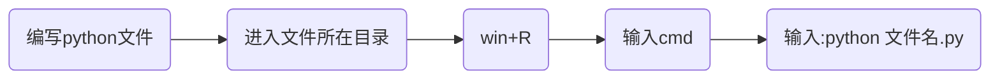
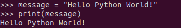
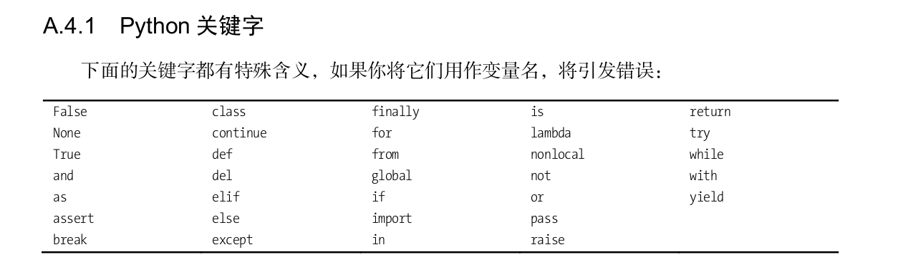
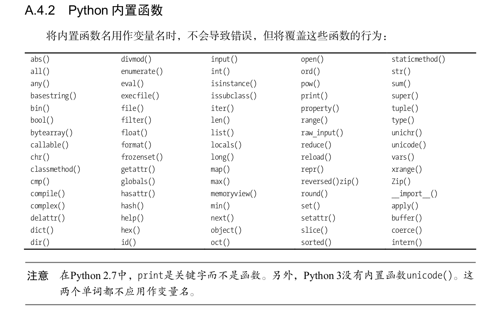

# Python编程从入门到实践


## 第1章 起 步

### 1.1 环境搭建

在不同的操作系统中，Python存在细微的差别。

#### 1.1.1 Python 2和 Python 3

当前，有两个不同的Python版本：Python 2和较新的Python 3。

如果你的系统安装的是Python 3，那么有些使用Python 2编写的代码可能无法正确地运行。

>
>
>Tip：直接选择学Python3


#### 1.1.2 Python解释器

当我们从[Python官方网站](https://www.python.org/)下载并安装好Python 3.x后，我们就直接获得了一个官方版本的解释器：CPython。这个解释器是用C语言开发的，所以叫CPython。在命令行下运行`python`就是启动CPython解释器。

Python的解释器很多，但使用最广泛的还是CPython。


#### 1.1.3 Hello World 程序

```python
print("Hello World")
```


### 1.2 在不同操作系统中搭建 Python 编程环境

[Python各版本下载](https://www.python.org/downloads/)


### 1.3 解决安装问题

[自行谷歌解决](http://www.google.cn/)


### 1.4 从终端运行 Python 程序

#### 1.4.1 在 Windows 系统中从终端运行 Python 程序



### 1.5 小结

本章需要掌握知识点：

- 掌握Python环境搭建
- 了解Python解释器
- 编写并运行Hello_world.py
- 会在[Python官网](https://www.python.org/)上检索资料


## 第2章 变量和简单数据类型

### 2.1 运行 hello_world.py 时发生的情况


### 2.2 变量

**变量**：可以变化的量

变量的简单使用：

```python
message = "Hello Python World!"
print(message)
```

 

上面的运行结果：



上述代码中**message**就是定义的一个变量，**message**和文本“**Hello Python World**”相关联。

>
>
>Tip: 在程序运行过程中，变量的值是可以发生改变的，python会记录变量最新的值。


#### 2.2.1 变量的命名和使用

- 变量名只能包含**字母**、**数字**和**下划线**。变量名可以字母或下划线打头，但**不能以数字开头**
- 不要将**Python关键字**和**函数名**用作变量名，即不要使用Python保留用于特殊用途的单词
- 变量名应做到见名知意(非Python强制要求，属于编码习惯，不会出现python语法错误)
- 慎用小写字母l和大写字母O，因为它们可能被人错看成数字1和0(非Python强制要求，属于编码习惯，不会出现python语法错误)


​    **Python关键字和内置函数**：  

​	

​		

#### 2.2.2 使用变量时避免命名错误


### 2.3  字符串

计算机顾名思义就是可以做数学计算的机器，因此，计算机程序理所当然地可以处理各种数值。但是，计算机能处理的远不止数值，还可以处理文本、图形、音频、视频、网页等各种各样的数据，不同的数据，需要定义不同的数据类型(分类管理，避免乱套)。在Python中，能够直接处理的数据类型有以下几种：

- 整数
- 浮点数
- 字符串
- 布尔值
- 空值
- 列表
- 字典
- 自定义数据类型


**字符串**是以单引号`'`或双引号`"`括起来的任意文本，比如`'abc'`，`"xyz"`等等。

```python
"This is a string."
'This is also a string.'
```

>
>
>Tip:  `''`或`""`本身只是一种表示方式，不是字符串的一部分，因此，字符串`'abc'`只有`a`，`b`，`c`这3个字符。如果`'`本身也是一个字符，那就可以用`""`括起来，比如`"I'm OK"`包含的字符是`I`，`'`，`m`，空格，`O`，`K`这6个字符。


#### 2.3.1 使用方法修改字符串的大小写

```方法名：title()```     

```功能:```将每个单词的首字母大写

```示例：```

```python
message = "houyanzi hunyiha"
message.title()
```

```输出:```

```python
Houyanzi Hunyiha
```


```方法名：lower()```   

```功能：```将所有的单词小写

```使用场景:```验证码忽略大小写的时候，校验

```示例：```

```python
message = "HouYanZi HunYiHa"
message.lower()
```

```输出:```

```python
houyanzi hunyiha
```


#### 2.3.2 合并（拼接）字符串

Python使用加号（ + ）来合并字符串。


#### 2.3.3 使用制表符或换行符来添加空白

在编程中， 空白泛指任何非打印字符(打印出来看不见)，如空格、制表符和换行符。空白可以用来格式化输出。

​	```换行符：``` \\n

​	```制表符:``` \\t


#### 2.3.4 删除空白

```方法名：rstrip()```

```功能：```删除字符串末尾的空白字符

```助记:```right + strip剔除

```示例：```

```python
message = "HouYanZi HunYiHa  "
message.rstrip()
```

```输出:```

​			```houyanzi hunyiha```


```方法名：lstrip()```

```功能：```删除字符串前面的空白字符

```助记:```left + strip

```示例：```

```python
message = "   HouYanZi HunYiHa"
message.rstrip()
```

```输出:```

​			```houyanzi hunyiha```


```方法名：strip()```

```功能：```删除字符串两端的空白字符

```助记:```  strip剔除

```示例：```

```python
message = "   HouYanZi HunYiHa   "
message.rstrip()
```

```输出:```

​			```houyanzi hunyiha```


>
>
>strip()、lstrip()、rstrip()不会对变量本身作出改变，如果要改变需要使用该变量去接收方法的返回值！


#### 2.3.5 使用字符串时避免语法错误


#### 2.3.6 Python 2 中的 print 语句


### 2.4 数字

#### 2.4.1 整数

在Python中，可对整数执行加（ + ）减（ - ）乘（ * ）除（ / ）乘方（**）运算。

```cmd
>>> 1 + 1
2
>>> 2 - 1
1
>>> 2 * 2
4
>>> 3 / 2
1.5
>>> 2 ** 3
8
```


#### 2.4.2 浮点数

带小数点的数字都称为**浮点数**。浮点数的计算结果不一定准确(计算机中整数和浮点数储存方式不一样)。

```cmd
>>> 0.1 + 0.1
0.2
>>> 0.2 + 0.2
0.4
>>> 0.2 * 2
0.4
>>> 0.1 + 0.2
0.30000000000000004
```

>
>
>Tip：上面0.1 + 0.2结果出现了0.30000000000000004。


#### 2.4.3 使用函数 str()避免类型错误

birthday.py

***

```python
age = 23 
message = "Happy " + age + "rd Birthday!"
print(message)
```

上述代码会出现异常，因为age是数字类型，不能直接和字符串进行**+**运算。

可以调用函数str()将数字转换为字符串。


#### 2.4.4 Python 2 中的整数

```cmd
>>> python2.7
>>> 3 / 2
1
```

Python2中整数相除只包含整数部分，小数部分被删除，是删除不是四舍五入。


### 2.5 注释

注释是写给人看的。


#### 2.5.1 如何编写注释

在Python中，单行注释用**#**标识，多行注释使用```'''```标识。

```python
# 我是一个注释

'''
	我是多行注释
'''
```


#### 2.5.2 该编写什么样的注释

给人看的注释


#### 2.6 Python 之禅

python终端中输入```import this```查看python之禅

```python
>>> import this
The Zen of Python, by Tim Peters

Beautiful is better than ugly.
Explicit is better than implicit.
Simple is better than complex.
Complex is better than complicated.
Flat is better than nested.
Sparse is better than dense.
Readability counts.
Special cases aren't special enough to break the rules.
Although practicality beats purity.
Errors should never pass silently.
Unless explicitly silenced.
In the face of ambiguity, refuse the temptation to guess.
There should be one-- and preferably only one --obvious way to do it.
Although that way may not be obvious at first unless you're Dutch.
Now is better than never.
Although never is often better than *right* now.
If the implementation is hard to explain, it's a bad idea.
If the implementation is easy to explain, it may be a good idea.
Namespaces are one honking great idea -- let's do more of those!
>>>
```


### 2.7 小结

- 变量的使用
- 变量名命名规范
- 字符串相关的几个方法
- 整数和浮点数的使用


## 第3章 列表简介

### 3.1 列表是什么

列表由一系列按特定顺序排列的元素组成，是**有序集合**。

Python中使用`[]`定义列表，列表中的元素使用```,```隔开。

```python
# 列表的定义
name = ["侯燕子", "臭宝", "宝宝"]

# 列表的打印
print(name)
```

打印结果如下：

```cmd
['侯燕子', '臭宝', '宝宝']
```


#### 3.1.1 访问列表元素

列表是有序集合，可以通过索引访问列表中的元素，索引从0开始。

```语法：```列表名称[索引]

 ```示例:```		

```python
# 定义列表
name = ["侯燕子", "臭宝", "宝宝"]
# 打印列表中索引为1的元素
print(name[1])
```

 打印结果如下：

```cmd
臭宝
```

 >
 >
 >Tip：没有[]和引号


```空列表创建:```name = []


#### 3.1.2 索引从 0 而不是 1 开始

在大多数编程语言中，第一个列表元素的索引为0，而不是1。

根据这种简单的计数方式，要访问列表的任何元素，都可将其**位置减1**，并将结果作为索引。

在不知道列表长度的情况下，如果需要访问最后一个元素，可以使用索引**-1**表示最后一个，索引**-2**表示倒数第二个，以此类推。

```python
# 定义列表
name = ["侯燕子", "臭宝", "宝宝"]
# 打印列表中索引为1的元素
print(name[-1])
```

打印结果如下：

```cmd
宝宝
```


#### 3.1.3 使用列表中的各个值

```需求:```打印```name```列表中的每一个值

你可能会说这还不简单，```name[0]```，```name[10]```，```name[2]```不就好了

```python
print(name[0])
print(name[1])
print(name[2])
```

如果```name```列表中有300个数据呢？300行print()吗？按照代码行数发工资，那恭喜你，发财了！

```解决方案：```循环


### 3.2 修改、添加和删除元素

#### 3.2.1 修改列表元素

```语法:```列表名[索引] = 新值

 ```示例:```  

  ```python
# 定义列表
name = ["侯燕子", "臭宝", "宝宝"]
# 打印列表
print(name)

# 将列表name索引为1的值修改为 狗子
name[1] = "狗子"
print(name)
  ```

输出结果：

```cmd
['侯燕子', '臭宝', '宝宝']
['侯燕子', '狗子', '宝宝']
```


#### 3.2.2 在列表中添加元素

##### 3.2.2.1在列表末尾添加元素

```方法：```append()

```功能:```在列表末尾添加元素

 ```示例：```

```python
# 定义列表
name = ["侯燕子", "臭宝", "宝宝"]
print(name)

# 列表末尾添加元素
name.append("狗子")
```

输出结果：

```cmd
['侯燕子', '臭宝', '宝宝']
['侯燕子', '臭宝', '宝宝', '狗子']
```


##### 3.2.2.2 在列表中插入元素

```方法：```insert(index,value)

```功能:```在列表任意位置添加元素

 ```示例：```

```python
# 定义列表
name = ["侯燕子", "臭宝", "宝宝"]
print(name)

name = ["侯燕子", "臭宝", "宝宝"]
name.insert(1,"小侯子")
print(name)

# 列表末尾添加元素
name.insert(4,"狗子")
print(name)
```

输出结果：

```cmd
['侯燕子', '臭宝', '宝宝']
['小侯子', '侯燕子', '臭宝', '宝宝']
['小侯子', '侯燕子', '臭宝', '宝宝', '狗子']
```


#### 3.2.3 从列表中删除元素

##### 3.2.3.1使用del语句删除元素

如果知道元素在列表中的索引，可以使用```del语句```删除元素

```python
# 定义列表
name = ["侯燕子", "臭宝", "宝宝"]
print(name)

# 使用del语句删除name列表中索引为1的元素
del name[1]
print(name)
```

输出结果：

```cmd
['侯燕子', '臭宝', '宝宝']
['侯燕子', '宝宝']
```

使用del语句将值从列表中删除后，你就无法再访问它了


##### 3.2.3.2 使用方法pop()删除元素

如果需要删除列表末尾的元素，那么我们可以使用```pop()```方法，并用一个变量去接收返回值。

列表就像一个栈，而删除列表末尾的元素相当于弹出栈顶元素[FILO]。

```python
# 定义列表
name = ["侯燕子", "臭宝", "宝宝"]
print(name)

# 使用pop方法删除name列表中最后一个元素
popped_name = name.pop()
print(name)
print(popped_name)
```

输出结果：

```cmd
['侯燕子', '臭宝', '宝宝']
['侯燕子', '臭宝']
宝宝
```


##### 3.2.3.3 弹出列表中任何位置处的元素

上面的pop()方法可以弹出列表末尾的元素，name我们需要删除列表任意位置的元素，并使用删除的元素怎么办呢？pop()方法也可以做到，只需要指定索引的值即可。

```python
# 定义列表
name = ["侯燕子", "臭宝", "宝宝"]
print(name)

# 使用pop方法删除name列表中索引为1的元素
popped_name = name.pop(1)
print(name)
print(popped_name)
```

输出结果：

```cmd
['侯燕子', '臭宝', '宝宝']
['侯燕子', '宝宝']
臭宝
```


##### 3.2.3.4 根据值删除元素

如果你不知道需要删除元素的索引，那么我们可以使用```remove()```方法根据值删除元素。

```方法名:```remove()

```功能：```根据值从列表中删除元素，且方法没有返回值。

```Tip：```方法remove()只删除第一个指定的值。如果要删除的值可能在列表中出现多次，就需要

使用循环来判断是否删除了所有这样的值，后续会详细说明。

```示例：```

```python
# 定义列表
name = ["侯燕子", "臭宝", "宝宝"]
print(name)

# 使用remove()方法删除name列表中的"臭宝"
name.remove("臭宝")
print(name)
```

输出结果：

```cmd
['侯燕子', '臭宝', '宝宝']
['侯燕子', '宝宝']
```


### 3.3 组织列表

#### 3.3.1 使用方法 sort()对列表进行永久性排序

```方法名：```sort()

```功能:```对列表进行排序,排序规则为按照unicode码进行排序，类似字典规则。

```Tip:```

​			按照Unicode码从小到大进行排序，并且排序是永久性的。

​			如果需要按照unicode码从大到小进行排序,只需向sort()方法传递参数```reverse=True```

```示例：```

```python
# 定义列表
name = ["侯燕子", "臭宝", "宝宝"]
#  臭 \u81ed  宝 \u5b9d   侯 \u4faf
name.sort();

# 宜 \u5b9c  宝 \u5b9d  实 \u5b9e
simplified_chinese = ["实","宝","宜"]
simplified_chinese.sort()

print(name)
print(simplified_chinese)

# 传递reverse=True 使列表按照unicode码按照从大到小的顺序进行排序
simplified_chinese.sort(reverse=True)
print(simplified_chinese)
```

输出结果:

```cmd
['侯燕子', '宝宝', '臭宝']
['宜', '宝', '实']
['实', '宝', '宜']
```

```示例说明：```

  中文及其Unicode码对应关系(\u+十六进制unicode码)：    宜 \u5b9c     宝 \u5b9d     实 \u5b9e

  比较这三个字符对应的unicode码的大小： 

​           前面都为5b9，那么比较最后1位数字，c<d<e

​           十六进制里面a表示10，b表示11，c表示12 ... f表示15


[Unicode码与中文互转小工具](https://www.bejson.com/convert/unicode_chinese/)


#### 3.3.2 使用函数 sorted()对列表进行临时排序

```函数名:```sorted()

```功能:```按照Unicode码从小到大进行排序,可以传递参数reverse=True使排序由大到小

``示例：``

```python
cars = ['bmw', 'audi', 'toyota', 'subaru']

print("Here is the original list:")
print(cars)

print("\nHere is the sorted list:")
sorted_cars = sorted(cars,reverse=True)
print(sorted_cars)

print("\nHere is the reverse list")
reverse_cars = sorted(cars, reverse = True)
print(reverse_cars)

print("\nHere is the original list again:")
print(cars)
```

输出结果：

```cmd
Here is the original list:
['bmw', 'audi', 'toyota', 'subaru']

Here is the sorted list:
['toyota', 'subaru', 'bmw', 'audi']

Here is the reverse list
['toyota', 'subaru', 'bmw', 'audi']

Here is the original list again:
['bmw', 'audi', 'toyota', 'subaru']
```


#### 3.3.3 倒着打印列表

```方法名：```reverse()

```功能:```将列表中的元素永久性反转，和排序没有关系

```示例：```

```python
# 定义列表
name = ["侯燕子", "臭宝", "宝宝"]

# 列表反转
name.reverse()

print(name)
```

输出结果:

```cmd
['宝宝', '臭宝', '侯燕子']
```


#### 3.3.4 确定列表的长度

```函数名:```len()

```功能：```获取列表长度

```示例：	```

```python
# 定义列表
name = ["侯燕子", "臭宝", "宝宝"]

len_name = len(name)
print(len_name)
```

输出结果：

```cmd
3
```


### 3.4 使用列表时避免索引错误

- 索引从0开始
- 可以使用```列表名[-1]```访问列表中最后一个元素，当列表为空时，出现异常。


### 3.5 小结

- 列表的概念
- 列表的定义，取值
- 列表的增删改查、排序、反转、长度
- ```差一错误```及避免方式


## 第4章 操作列表

### 4.1 遍历整个列表

```需求：```输出```nicknames```列表中每个元素

```解决方案:```使用print()函数打印nickname[0]、nickname[1].....

```问题:```

- 列表长度不确定怎么办？
- 列表长度太长怎么办？几百上千行print()函数？
- 如果需要增加列表长度怎么办？是不是需要改很多源代码？

```解决办法:```循环

```示例:```

```python
nicknames = ["侯燕子", "臭宝", "宝宝"]

# 从列表nicknames中取出一个名字，并将其存储在零时变量nickname中
for nickname in nicknames:
    # 将储存在nickname中的变量打印输出
    print(nickname)
```

输出结果：

```cmd
侯燕子
臭宝
宝宝
```


#### 4.1.1 深入地研究循环

```循环```是让计算机自动完成重复工作的常见方式之一。


Python将首先读取其中的第一行代码：

---

```python
for nickname in nicknames:
```

---

这行代码让Python获取列表```nicknames```中的第一个值（"侯燕子"），并将其存储到变量```nickname```中。接下来，Python读取下一行代码：

---

```python
print(nickname)
```

---

它让Python打印```nickname```的值——依然是'侯燕子'。鉴于该列表还包含其他值，Python返回到循环的第一行：

---

```python
for nickname in nicknames:
```

---

这行代码让Python获取列表```nicknames```中的第二个值（"臭宝"），并将其存储到变量```nickname```中。接下来，Python执行下一行代码：

---

```python
print(nickname)
```

---

Python再次打印变量```nickname```的值——当前为'臭宝'。接下来，Python再次执行整个循环，对列表中的最后一个值——'宝宝'进行处理。至此，列表中已经没有其它的值了，因此Python执行后续的代码。


#### 4.1.2 在 for 循环中执行更多的操作

在for循环中，可对每个元素执行任何操作。下面来扩展前面的示例，对于每个```nickname```，都打印一条消息，指出她太漂亮了。

```python
# 定义列表
nicknames = ["侯燕子", "臭宝", "宝宝"]

for nickname in nicknames:
    print(nickname + "太漂亮了")
```

输出结果：

```cmd
侯燕子太漂亮了
臭宝太漂亮了
宝宝太漂亮了
```


#### 4.1.3 在 for 循环结束后执行一些操作

我们在循环完成后，打印一句```循环执行完成了```

```python
# 定义列表
nicknames = ["侯燕子", "臭宝", "宝宝"]

for nickname in nicknames:
    print(nickname + "太漂亮了")

print("循环执行完成了")
```

输出结果:

```cmd
侯燕子太漂亮了
臭宝太漂亮了
宝宝太漂亮了
循环执行完成了
```

在python中，我们使用```缩进```来表示代码块。


### 4.2 避免缩进错误

**Python根据缩进来判断代码行与前一个代码行的关系**。

**Python通过使用缩进让代码更易读；**

**常见的缩进错误:**

- 将不需要缩进的代码块缩进

- 必须缩进的代码块却忘了缩进


#### 4.2.1 忘记缩进

对于位于for语句后面且属于循环组成部分的代码行，一定要缩进。如果你忘记缩进，Python会提醒你

```python
# 定义列表
nicknames = ["侯燕子", "臭宝", "宝宝"]

for nickname in nicknames:
print(nickname + "太漂亮了")

print("循环执行完成了")
```

输出结果:

```cmd
File "D:\workspace\python\python编程从入门到实践\列表简介\cars.py", line 12
print(nickname + "太漂亮了")
^
IndentationError: expected an indented block
```

明显，上面的代码运行时候出现了异常。


#### 4.2.2 忘记缩进额外的代码行

```需求：```在每一次打印```**太漂亮了```之后在打印一句```你说是不是？```

 ```错误示例:```

```python
# 定义列表
nicknames = ["侯燕子", "臭宝", "宝宝"]

for nickname in nicknames:
    print(nickname + "太漂亮了")
print("你说是不是")
print("循环执行完成了")
```

输出结果：

```cmd
侯燕子太漂亮了
臭宝太漂亮了
宝宝太漂亮了
你说是不是
循环执行完成了
```

```结果分析:```

- 输出结果与我们的需求不同，究其原因是```print("你说是不是")```应该缩进但是我们代码没有进行缩进。
- 这里属于```逻辑错误```语法上没有问题。
- 特别注意，在python中我们通过缩进来表示语句之间的所属关系。


#### 4.2.3 不必要的缩进

```python
# 定义列表
nicknames = ["侯燕子", "臭宝", "宝宝"]
	print(nicknames)
```

输出结果:

```cmd
D:\python\python.exe D:/workspace/python/python编程从入门到实践/列表简介/cars.py
  File "D:\workspace\python\python编程从入门到实践\列表简介\cars.py", line 10
    print(nicknames)
IndentationError: unexpected indent
```


```结果分析：```

- 程序运行报错,因为代码中```print(nicknames)```并不属于上一条语句
- 务必记住，python中使用缩进表示所属关系


#### 4.2.4 循环后不必要的缩进

```需求:	```在for循环遍历列表结束后打印**循环执行完成了**

```错误示例:```

```python
# 定义列表
nicknames = ["侯燕子", "臭宝", "宝宝"]

for nickname in nicknames:
    print(nickname + "太漂亮了")
	print("循环执行完成了")
```

输出结果:

```cmd
侯燕子太漂亮了
循环执行完成了
臭宝太漂亮了
循环执行完成了
宝宝太漂亮了
循环执行完成了
```

```结果分析:	```

- 我们需求是在循环执行完成后，打印一次"**循环执行完成了**"，但是输出结果不同，究其原因是后面那条打印语句不需要缩进，但是我们缩进了，成了循环的一部分。
- 这里属于```逻辑错误```，python不会报错。


#### 4.2.5 遗漏了冒号

for循环后缺失**：**,造成**语法错误**, python运行过程中会报错。

```python
# 定义列表
nicknames = ["侯燕子", "臭宝", "宝宝"]

for nickname in nicknames
    print(nickname + "太漂亮了")
```

输出结果:

```cmd
  File "D:\workspace\python\python编程从入门到实践\列表简介\cars.py", line 11
    for nickname in nicknames
                             ^
SyntaxError: invalid syntax
```


### 4.3 创建数值列表

#### 4.3.1 使用函数 range()

```函数名:```range()

```作用:```生成一个可迭代对象

```示例：```

```python
for value in range(1,5):
    print(value)
```

输出结果:

```cmd\
1
2
3
4
```


```注意点:```

- 参数为左闭右开区间
- 默认步长为1，可设置步长为负数


#### 4.3.2 使用 range()创建数字列表

要创建数字列表，可使用函数list()将range()的结果直接转换为列表。

```示例：```

```python
numbers = list(range(1,5))
print(numbers)
```

输出结果:

```python
[1, 2, 3, 4]
```


#### 4.3.3 对数字列表执行简单的统计计算

有几个专门用于处理数字列表的Python函数。

```min():```数字列表的最小值

```max():```数字列表的最大值

```sum():```数字列表的和


```python
# 创建一个空列表
squares = []

# range()函数生成一个可迭代对象
for value in range(1,6):
    # 对生成的可迭代对象进行遍历，对于每一个值求平方之后添加到上文的空列表中
    squares.append(value**2)

print("列表：" ,squares)

print("列表中最小值:", min(squares))
print("列表中最大值:", max(squares))
print("列表中所有元素的和:", sum(squares))
```

输出结果：

```cmd
列表： [1, 4, 9, 16, 25]
列表中最小值: 1
列表中最大值: 25
列表中所有元素的和: 55
```


#### 4.3.4 列表解析

```列表解析的作用:```个人理解是为了简化书写

```python
squares = [value**2 for value in range(1,6)]
print(square)
```

上面代码和下面代码等价:

```python

squares = []
for value in range(1,6):
    squares.append(value**2)
print(squares)
```


```列表解析代码分析:```

代码分为三部分：

- ```表达式``` 定义新列表中值的生成规则
- ```循环```为表达式提供值

- ```[]```


### 4.4 使用列表的一部分

```切片：```处理列表中的部分元素

```创建切片方法:```列表名[起始索引:终止索引]

- 创建切片时,索引取值也是左闭右开区间
- 如果```:```左边省略表示从索引0开始，右边省略不写表示到列表最后结束，前后都省略表示列表全部。
- 负数索引表示倒数列表倒顺第几。


#### 4.4.3 复制列表

可以采用```切片```的方式来创建列表。```[:]```

```思考：```能否使用列表变量名赋值的方式来创建列表？如果不能，如何证明？

```python
nicknames = ["侯燕子", "臭宝", "宝宝"]
new_nicknames = nicknames
nicknames.append("小傻瓜")
print(new_nicknames)
```

结果输出：

```cmd
['侯燕子', '臭宝', '宝宝', '小傻瓜']
```

```输出结果分析:```

- 我们将```nicknames```赋值给```new_nicknames```之后，将```nicknames```列表中添加一个元素，但是我们在打印的时候```new_nicknames```中却出现了新添加的值。这说明```nicknames```和```new_nicknames```都指向同一个列表。


```列表创建过程分析:```

---

```python
["侯燕子", "臭宝", "宝宝"]
```

---

我们创建列表的时候，操作系统为我们分配储存列表内容的内存空间。


---

```python
nicknames = ["侯燕子", "臭宝", "宝宝"]
```

---

然后将列表中的第一个值的内存地址储存到```nicknames```变量中。


---

```python
new_nicknames = nicknames
```

---

又申请了一个变量，这个变量里面储存的值为```nicknames```中的值，也就是列表中第一个元素的内存地址。

所以，```nicknames```和```new_nicknames```都是指向的同一个内存区域，同一个列表。


### 4.5 元组

Python将不能修改的值称为不可变的，而```不可变的列表被称为```**元组**。

#### 4.5.1 定义元组

元组和列表的定义方式类似，只是使用圆括号而不是方括号来标识。

```元组中元素的访问方式:```元组名[索引]

```python
nums = (100, 200)
print(nums[0])
print(nums[1])
```

输出结果:

```cmd
100
200
```


元组中的元素是不能够修改的，如果修改就会出现异常。

```python
nums = (100, 200)
nums[1] = 200
```

```cmd
Traceback (most recent call last):
  File "D:\workspace\python\python编程从入门到实践\列表简介\cars.py", line 8, in <module>
    nums[1] = 200
TypeError: 'tuple' object does not support item assignment
```


#### 4.5.2 遍历元组中的所有值

可以通过for循环来遍历元组。

```python
nums = (100, 200)
for value in nums:
	print(value)
```

输出结果:

```cmd
100
200
```


#### 4.5.3 修改元组变量

虽然不能修改元组的元素，但可以给存储元组的变量赋值。如果我们需要修改元组的值，那么我们可以重新定义一个元组。

```python
nums = (100, 200)
nums = (200, 300)
print(nums)
```

输出结果:

```cmd
(200, 300)
```


```说明:```

- 元组的值:也就是元组里面每个元素的值
- 元组变量的值:就是储存元组所在内存区域的第一地址值


#### 4.6 设置代码格式

代码格式的这一块，我们在后面函数部分和项目部分讲解。


### 4.7 小结

Python 项目大多都遵循 [**PEP 8**](https://www.python.org/dev/peps/pep-0008) 的风格指南；它推行的编码风格易于阅读、赏心悦目。Python 开发者均应抽时间悉心研读；以下是该提案中的核心要点：

- 缩进，用 4 个空格，不要用制表符。

  4 个空格是小缩进（更深嵌套）和大缩进（更易阅读）之间的折中方案。制表符会引起混乱，最好别用。

- 换行，一行不超过 79 个字符。

  这样换行的小屏阅读体验更好，还便于在大屏显示器上并排阅读多个代码文件。

- 用空行分隔函数和类，及函数内较大的代码块。

- 最好把注释放到单独一行。

- 使用文档字符串。

- 运算符前后、逗号后要用空格，但不要直接在括号内使用： `a = f(1, 2) + g(3, 4)`。

- 类和函数的命名要一致；按惯例，命名类用 `UpperCamelCase`，命名函数与方法用 `lowercase_with_underscores`。命名方法中第一个参数总是用 `self` (类和方法详见 [初探类](https://docs.python.org/zh-cn/3/tutorial/classes.html#tut-firstclasses))。

- 编写用于国际多语环境的代码时，不要用生僻的编码。Python 默认的 UTF-8 或纯 ASCII 可以胜任各种情况。

- 同理，就算多语阅读、维护代码的可能再小，也不要在标识符中使用非 ASCII 字符。


## 第5章 if语句

### 5.1 一个简单示例

```需求：```以首字母大写的方式打印列表中的汽车名，但对于汽车名'bmw'，以全大写的方式打印

```示例:```

```python
cars = ['audi', 'bmw', 'subaru', 'toyota']

for car in cars:
    if car == 'bmw':
        print(car.upper())
    else:
        print(car)
```

输出结果：

```cmd
audi
BMW
subaru
toyota
```


### 5.2 条件测试

每条```if语句```的核心都是一个值为True或False的表达式，这种表达式被称为**条件测试**。

Python根据条件测试的值为True还是False来决定是否执行if语句中的代码。


#### 5.2.1 检查是否相等

大多数条件测试都将一个变量的当前值同特定值进行比较。最简单的条件测试检查变量的值

是否与特定值相等：

```python
# 定义变量car 并赋值为字符串bmw
car = 'bmw'

# 判断car中的内容是否为bmw。如果是，则执行if下面的代码块。
if car == 'bmw':
    print("我执行了")
```

输出结果：

```cmd
我执行了
```


#### 5.2.2 检查是否相等时不考虑大小写

在比较字符串是否相等的时候，如果需要忽略大小写，那么可以先将字符串都统一转换为大/小写然后再比较。

```python
car = 'Bmw'

if car.lower() == 'bmw':
    print("我执行了")
```

执行结果：

```cmd
我执行了
```


#### 5.2.3 检查是否不相等

在比较字符串是否不相等的时候，我们可以使用```!=```运算符。如果不相等，则返回True，反之返回False。

```python
car = 'Bmw'
if car != 'bwm':
    print("我执行了")
```

执行结果：

```cmd
我执行了
```

> Tips: 有时候检查两个值是否不等的效率更高


#### 5.2.4 比较数字

```大于(>)```   ```大于等于(>=)```   ```小于(<)```    ```小于等于(<=)```   ```==(等于)```    ```!=(不等于)```


```python
age = 18

print(age > 15)
print(age >= 15)
print(age < 20)
print(age <= 15)
print(age == 18)
print(age != 18)
```

输出结果：

```cmd
True
True
True
False
True
False
```


#### 5.2.5 检查多个条件

##### 5.2.5.1 使用and检查多个条件

```and```连接的多个条件，如果每个测试都为```True```，整个表达式就为True；

```and```连接的多个条件，如果至少有一个测试没有通过，整个表达式就为False。

```python
number_1 = 18
number_2 = 20

print((number_1 > 15) and (number_1 <= 20))
print((number_2 > 15) and (number_2 <= 18))
```

输出结果：

```cmd
True
False
```


##### 5.2.5.2 使用or检查多个条件

```or```连接的多个条件，如果每个测试都为```False```，整个表达式就为```false```；

```or```连接的多个条件，如果至少有一个测试为```True```，整个表达式就为```True```。

```cmd
number_1 = 18
number_2 = 20

print((number_1 > 15) or (number_1 >= 25))
print((number_2 < 15) or (number_2 <= 18))
```

输出结果：

```cmd
True
False
```


#### 5.2.6 检查特定值是否包含在列表中	

```关键字:```   **in**

```功能：``` 检查某个值是否**在**列表中

```示例：```

```python
nicknames = ["侯燕子", "臭宝", "宝宝"]

print("臭宝" in nicknames)
print("狗子" in nicknames)
```

输出结果：

```cmd
True
False
```


#### 5.2.7 检查特定值是否不包含在列表中

```关键字:```  **not  in**

```功能：``` 检查某个值是否**不在**列表中

```示例：```

```python
nicknames = ["侯燕子", "臭宝", "宝宝"]


print("狗子" not in nicknames)
print("臭宝" not in nicknames)
```

输出结果：

```cmd
True
False
```


#### 5.2.8 布尔表达式

```布尔表达式:```条件测试的别名。布尔表达式的结果要么为True，要么为False

布尔值通常用于记录条件，如游戏是否正在运行，或用户是否可以编辑网站的特定内容：

---

```python
game_active = True 
can_edit = False
```

---


### 5.3 if 语句

#### 5.3.1 简单的 if 语句

最简单的if语句只有一个测试和一个操作：

```python
if conditional_test: 
	do something
```

如果条件测试```conditional_test```的结果为True,则执行if后面的代码。

如果条件测试```conditional_test```的结果为False,则不执行if后面的代码。


#### 5.3.2 if-else 语句

```语法格式：```

```python
if conditional_test: 
	do something
else:
    do something
```

如果条件测试```conditional_test```的结果为**True**,则执行**if**后面的代码

如果条件测试```conditional_test```的结果为**Fasle**,则执行**else**后面的代码。

```if-else```结构中总有语句会被执行。


#### 5.3.3 if-elif-else 结构

经常需要检查超过两个的情形，为此可使用Python提供的```if-elif-else```结构。Python只执行```if-elif-else```结构中的一个代码块，它依次检查每个条件测试，直到遇到通过了的条件测试。测试通过后，Python将执行紧跟在它后面的代码，并跳过余下的测试。

```需求：```

- 4岁以下免费；

- 4~18岁收费5美元；

- 18岁（含）以上收费10美元。

```示例：```

```python
age = 16

if age < 4:
	print("4岁以下免费")
elif age >= 4 and age < 18:
	print("4~18岁收费5美元")
else:
	print("18岁（含）以上收费10美元")
```

输出结果：

```cmd
4~18岁收费5美元
```


#### 5.3.4 使用多个 elif 代码块

```需求：```

- 4岁以下免费；

- 4~18岁收费5美元；

- 18岁（含）以上收费10美元；
- 65岁（含）以上的老人，可以半价（即5美元）

```示例：```

```python
age = 65

if age < 4:
	print("4岁以下免费")
elif age >= 4 and age < 18:
	print("4~18岁收费5美元")
elif age >= 18 and age < 65:
	print("18岁（含）以上收费10美元")
else:
    print("65岁（含）以上的老人，可以半价（即5美元）")
```

```输出结果:```

```cmd
65岁（含）以上的老人，可以半价（即5美元）
```


#### 5.3.5 省略 else 代码块

如果使用```else```,则一定会有代码块被执行，其实```else```就是来兜底的。

如果某些时候我们为了不引入恶意的数据，使用```elif```来处理特定的数据。

```python
age = 65

if age < 4:
	print("4岁以下免费")
elif age >= 4 and age < 18:
	print("4~18岁收费5美元")
elif age >= 18 and age < 65:
	print("18岁（含）以上收费10美元")
elif age >= 65:
    print("65岁（含）以上的老人，可以半价（即5美元）")
```

我们在上面的数据中

